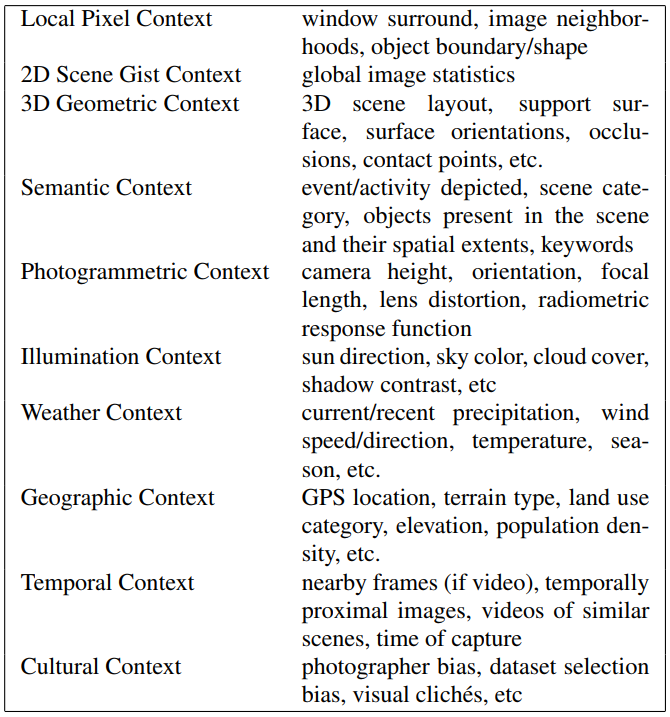

#### 1. 问题

- “上下文”对目标检测的有什么影响？
- 有多少种“上下文”？各自的影响有区别吗？

#### 2. 做法

使用目标检测标准数据集VOC2008（时间比较早），使用DPM作为baseline模型，_观察_各种不同的上下文（contextual cues）对各种任务的影响。

本文考察的上下文类型：

- Semantic
- Gist（2D scene gist）
- Geometric（3D geometric）
- Geographic

本文使用的任务：

- object present（分类）
- object location（检测）
- object size estimation（目标尺寸估计）

#### 3. 缺陷

本文的缺点在于，给出的结论无法直接用于其他任务，它具体的做法是，通过使用额外的数据集（Flickr，im2gps），得到“上下文”数据，训练分类器（逻辑回归）,然后加到算法中。

这么做的问题在于：

1. 本文工作的数据集不是封闭的。
2. “上下文”需要自己去找，而不是通过特定的算法，从已有的图像中挖掘。
3. 上下文和检测算法，是两个独立的东西，很难融合在一起。

不过本文提供了一个对“上下文”的归类清单：

一般论文中称“使用上下文”，指第一个“Local Pixel Context”，也就是目标周围的像素分布。其他类型的上下文用的很少，原因是需要额外的数据源（第三个到最后一个）。

**上下文有用的前提是，上下文和任务存在某种稳定的相关性**，否则上下文就是无关噪声。上表中的第二个就不一定有效，所以使用得并不多。

使用上下文有如下两种途径：

1. 增加额外数据源，比如本文方法。（上下文和目标不同源）
2. 设计更优算法，在已有基础上，更加充分利用已有数据。（上下文和目标同源）