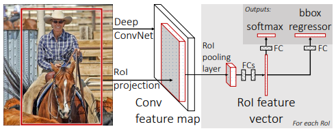
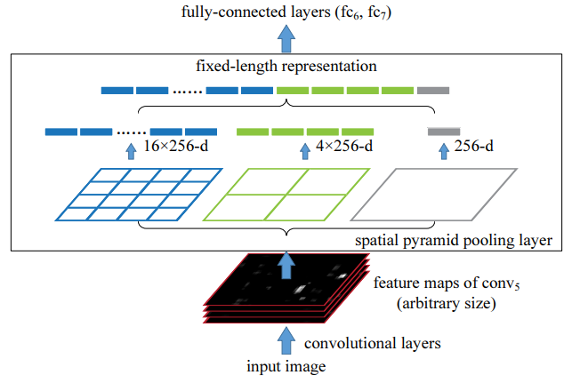
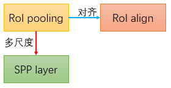

title: Fast R-CNN
date: "2018-03-15T07:52:00.000Z"
publish_time: "2015.04"
compare_method: [1,2]

### 1. 问题

本文要解决的问题是，如何让RCNN快一些？

### 2. 做法

RCNN最耗时的地方体现在，对于每一个proposal，都需要前馈计算一遍卷积网络。为什么RCNN需要对每一个proposal计算一遍前馈网络？因为在RCNN中，CNN的作用仅仅是特征提取器，输入滑窗内的像素，输出计算出的深度特征，然后给到SVM分类以及位置回归器（用最小二乘回归位置是DPM中使用的，在RCNN论文的附录C中详细阐述了具体做法，并取名为bounding-box regression）。

直接的想法是，让网络先对整张图像计算深度特征图，然后在深度特征图上找每个proposal对应的特征。这么做存在一个问题：RCNN的输入是固定大小的（227x227），所以在RCNN中，对各种不同大小的proposal，需要做一些处理转换成224x224（RCNN论文的附录A给出了几种转换方法），然后再用卷积网络提取特征。由于现在的proposal是从特征图上来，所以需要在特征图上，进行一些转换处理，得到固定大小的特征图。

SPPnet[^1]就是一个在特征图上通过一些转换操作，得到固定大小特征的方法，但SPPnet存在如下问题：

- 特征需要写到硬盘上缓存。
- SPP层之前的卷积层无法参与训练。

也就是说，SPP层让前后两部分截断了，为什么呢？（SPPnet的论文认为，SPP是一种类似Bag-of-Word的操作，输入可变长特征，输出定长特征，同时SPP还能保留空间位置信息，但是SPPnet并没有提供误差后向传播的方法，是不可训练的，遗憾的是，SPPnet文中并没有指出这一点。如果用类似pytorch具有自动求导功能的代码实现SPPnet，是否就能end2end训练了？应该是这样，那FastRCNN中提到的SPPnet的缺点，只是当时存在的缺点，现在应该不存在了，也就是说，目前的架构中，依然可以使用SPPlayer）

本文最大的贡献，是第一个在region-based的目标检测方法中，提出的端到端训练的模型。像Overfeat、YOLO、SSD等一阶段方法，很容易实现端到端模型。而这之前，RCNN和SPPnet，训练过程有一下几步：

1. 用ImageNet预训练模型
2. 提取特征
3. 用带log-loss的网络微调卷积网络
4. 训练SVM
5. 训练regressor

而本文所有的工作都在一次完成。

#### 2.1 RoI pooling or SPPlayer?

这一步的目的是，获得每个proposal的特征，同时保证特征的尺寸一样。分类任务需要特征具备可分性，位置回归需要特征保留空间位置信息（也就是它只对应原图中的某一部分区域，其他区域的像素变化，这部分的特征是不变的）。

SPPlayer和RoI pooling相比，多了一些尺度，这样让proposal计算的特征，具有不同尺度的特征。SPPlayer的计算如下图所示：

具体来说，它所谓的”尺度“，带来了两个变化：

1. 输出点不同，大尺度输出点少，小尺度输出点多。也就是输出的特征点的感受野大小，大尺度的感受野大，小尺度因为输出的特征点多，每个特征点的感受野就小。
2. 感受野变化，势必会损失空间位置信息（感受野变大，对分类有利，因为可以获得更多的信息，有利于特征的抽象程度，提取出具有可分性的特征，但是对位置回归不利，因为变大意味着，位置变模糊了）。想象一下，如果只用最右边那个尺度的特征，位置回归的效果应该会很差。上图中这三个尺度，是相互补充，还是嵌套呢？（如果是嵌套，那从SPPlayer到RoI pooling，就是很自然的进化过程）

SPPlayer、RoI pooling、RoIAlign三者的关系：

如果让RoIAlign具备多尺度，会怎么样？RoIAlign的输出是输入对应位置精确的值（双线性插值），如果多尺度，也就意味着会有多组采样点，每组采样点一定是不同位置的点，又因为RoIAlign采样的是精确位置的点，所以不同个位置的取值也一定不同，输出的特征图一定更加丰富，有可能会提高分类和位置回归的性能。

这一步在两阶段的目标检测方法中，是如此的重要，处于”瓶颈“的位置，有必要单独设计一种评价方法，测试各种RoI方法的性能，以便针对不同的任务设计更优的RoI方法。

另外要注意的是，这一步是不需要训练的，也就是它是和数据不太相关的，如果让它可以训练，效果会增还是减呢？

#### 2.2 多任务损失

用softmax替换之前的SVM分类器，这样一来，分类和回归可以作为网络的两个并行输出，一起训练。”多任务损失“这种思路，为”端到端“模型处理更多任务，提供了可能性。

多任务损失能够有效原因是，各个损失对特征的诱导趋势是一致的，或者至少不冲突，否则，多任务损失就无法收敛。举个极端的例子，如果有两个任务的损失，一个是正分类（自己造的词，正确分类），一个是负分类（错误分类），两个任务正好是”共轭“任务，如果用多任务损失同时训练这两个任务，网络一定不会收敛。（GAN的损失就是这样的两个共轭损失，但两个损失对应的是两个独立的网络，所以理论上是可以收敛的，但是实际如果不采取一些改进，GAN的训练也是很容易不收敛的。）

以上分析给出了一条思路：在进行多任务损失训练时，如果发现各个损失收敛的值要比单独训练每个损失的值大，那说明各个任务之间可能存在冲突，可以通过增加支路深度或减少共享特征来解决。

#### 2.3 Mini-batch sampling

两阶段的端到端训练模型（本文并不是，准确来说，FasterRCNN是），其中很重要的一步是两个阶段的衔接部分，对应到本文里的mini-batch sampling。这一步要做的事情是把之前离线做的工作，变成在线的形式。第一阶段得到的RoI，需要构建训练第二阶段的正负样本，根据RoI和gt的重叠比例来确定。一般这里会存在”样本不均衡“问题，有一些方法处理这个问题（SSD[^3]中的负样本挖掘，OHEM[^4]，FocalLoss[^5]）。这部分工作偏工程性，需要扎实的代码能力。

### 3. 逻辑推理

&loz; 因为需要一个计算模块，能够把不同尺寸的特征图变换成相同尺寸，同时还要保留空间位置信息，以输出给全连接层。

&diams; 所以，把spatial pyramid pooling拿过来。spatial pyramid pooling也叫spatial pyramid matching（SPM），是Bag-of-Words的一种扩展，能够保留空间信息。拿过来网络就变成了SPPnet。

&loz; 因为SPPlayer无法让网络端到端进行训练（历史局限性）。

&diams; 所以只取了SPPlayer中的一个尺度，简化版的SPPlayer，并计算了梯度传播的方式，这样前面的特征提取网络和后面的分类回归网络，就能端到端训练了。

&loz; 因为有一个观点”端到端训练的模型效果好“

&diams; 所以把SVM替换了softmax，把分类和回归用”多任务损失“的方式同时训练。

[^1]: Rich feature hierarchies for accurate object detection and semantic segmentatio
[^2]: Snpatial Pyramid Pooling in Deep Convolutional Networks for Visual Recognition
[^3]: SSD: Single Shot MultiBox Detector
[^4]: Training Region-based Object Detectors with Online Hard Example Mining
[^5]: Focal  Loss for Dense Object Detection

