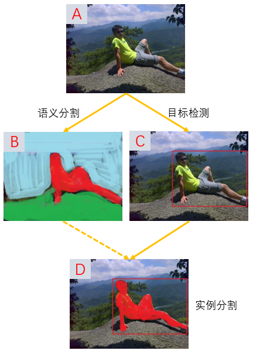
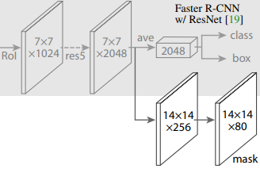
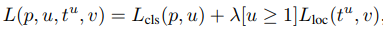
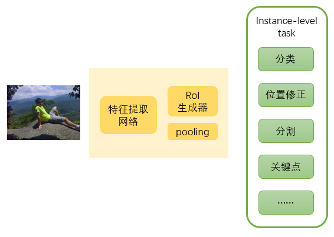

### 1. 问题
&emsp;&emsp;如何把FasterRCNN框架用于分割任务?

### 2. 做法

&emsp;&emsp;要解答上面这个问题，首先要想清楚，目标检测和分割的联系与区别，因为FasterRCNN是一个目标检测的方法，要用一个目标检测的方法，处理分割任务，就必须先把两个任务的关系找到。

#### 2.1 目标检测和分割的区别

&emsp;&emsp;目标检测和分割的区别在于，对目标的表达不同：目标检测认为目标只要用一个矩形框框住目标就行，而分割用目标的精细轮廓来表达目标。从结果来看，似乎目标检测相比于分割，更粗略。

&emsp;&emsp;另一方面，之前检测和分割，是两个独立的问题，尤其是在deeplearning之前，目标检测的思路是"滑动窗口+特征提取+分类器"，而分割的思路，比如超像素、分水岭、种子分割、主动轮廓等，研究方法完全不同，解决问题的思路也不一样。

&emsp;&emsp;而随着deepleaning在图像分类任务上取得的重大突破[^1], 目标检测领域出现了一些开拓性的工作[^2][^3][^4][^5], 分割领域也出现了一篇开篇工作[^6]。这些工作表明，目标检测和分割，可以用同一种框架去解决，区别仅仅在于网络的输出形式不同：目标检测的网络需要输出类别和位置，而分割的网络需要输出带类别信息的mask。

&emsp;&emsp;除非把两个任务关联起来，否则用一个网络同时处理两个任务不会有好处。目标检测和分割相互关联的结果，就是**实例分割**，让分割的对象具有“单个目标”的概念。

&emsp;&emsp;当分割具有目标属性时，“分割”的含义进一步缩小，仅针对目标的分割，也就是上图中的图D。这其实是缩小了分割的范畴，因为在图B中，绿色和蓝色的区域，一般认为是背景，我们不关注这两部分区域，但是在做语义分割的时候，他们是有语义的，蓝色表示远处的背景、蓝天、山脉等，绿色表示岩石。但是当做实例分割时，它们不属于目标，不用去分割。

&emsp;&emsp;所以回答上面提出的问题，首先要划定“分割”含义的范畴，FasterRCNN能够解决的分割任务，是语义分割的子集，即实例分割，它可以认为是精细化的目标检测，是目标检测从粗略的框扩展到精细的轮廓，必然的过程。

&emsp;&emsp;这么做有什么好处呢？

&emsp;&emsp;目标检测的目的是什么？目标检测在整个解决方案中，仅仅是第一步，第二步一般是确定目标的状态，从而采取下一步的行为。很显然，精细化的轮廓更有利于确定目标的状态。还是以上图为例，得到了人的矩形框，我们仅仅知道这里有一个人，但是这个人的状态完全未知。而如果得到精细的轮廓信息，可以很容易的从里面找到人的关键点，然后根据这些关键点的位置关系，确定人的状态；还能对人进行部位分割，获得更多的信息。总之，实例分割是目标检测必然的进化方向。

&emsp;&emsp;这有什么缺陷呢？

&emsp;&emsp;首先一点是，训练这样的模型，需要提供目标轮廓的标注数据（有一些半监督的工作，尝试处理没有轮廓标注数据），这就相当于另一个任务了。这篇文章能这样做的原因也正是因为，mscoco[^7]提供了这样的数据。

&emsp;&emsp;其次，分割的对象必须是目标。（实际往往如此）

#### 2.2 实例分割

&emsp;&emsp;上一节表明了，目标检测和分割的关系，体现为实例分割。实例分割的直观处理方法是：先找到目标的矩形框，然后在矩形框内分割。看似是一个前后依赖的序列任务，这篇文章却把这两个任务同时进行（其实是三个任务并行）。

&emsp;&emsp;上面两条支路得到proposal的类别得分、位置修正系数，第三条支路通过反卷积得到proposal对应的mask（不是整张图的mask，这是和语义分割的区别）。

&emsp;&emsp;能够把序列任务并行的原因在于损失的计算。比如前面获取了300个proposal（或者SSD300中8732个box），class支路会得到(300x81)的矩阵，计算分类损失。box支路会得到(300x4)，注意了，这些矩阵并没有都参与计算位置修正损失，而是其中属于目标的那些proposal。 找到每个proposal分数最高对应的类别，对其中的80类目标（除去背景）对应的proposal，计算位置修正损失。

对于mask支路，输出是$(K, m, m)$ 多维数组，$K$表示类别（上图中$K=80$）,$m$表示输出的大小。$L_{mask}$

的计算，只针对当前proposal所属的那一类，也就是说，一个proposal虽然会计算出$(K, m, m)$这么多数据，但是只有其中的$(1, m, m)$会参与损失的计算，其他输出都丢弃了。（就像上面的公式中，计算定位损失时，丢弃背景的回归系数）。具体的计算方式是，先对$(m,m)$中的每个值计算sigmoid（二分类），然后计算average binary cross entropy loss，得到$L_{mask}$的值。

&emsp;&emsp;要注意的是，MaskRCNN中mask的损失计算方式，和FCN[^6]是不同的。处理语义分割问题时，FCN是对输入图片的每一个像素进行多分类，属于稠密多分类问题，每一个像素使用softmax计算得分，损失通过multinomial cross entropy loss得到。而MaskRCNN对每个像素进行二分类。导致这个的区别的原因，本质上是由语义分割和实例分割的差异引起的。语义分割在进行分割时，仅仅知道这个像素的label，而实例分割在分割时，已经知道了这个像素所属的目标，也就是它的类别，此时的分割仅仅需要区分前景还是背景，做二分类即可。

#### 2.3 RoIAlign

&emsp;&emsp;RoIAlign是一个和预测mask没有直接联系的模块（之前一直以为仅mask支路需要用到RoIAlign，其实不然），它的作用是代替RoIPool，让这一步更加保留RoI的位置信息（分割问题对像素级位置很敏感）（为什么RoI会损失位置信息？它对结果有多大的影响？为什么以前的方法没有这个问题？这个需要单独一篇文字来思考）。从这里也能看出，RoIAlign对位置回归，也是有好处的。

从RoIPool到RoIAlign，完全是一个工程性的工作，结果确定的操作（这么做结果一定会好，只是代码写起来费劲，尤其要写GPU的版本）。（关于RoIAlign的详细理解，从原理到代码实现，需要一篇文字的思考，这里省略。）

### 3. 一些想法

&emsp;&emsp;和本文最相关的两篇文章MNC[^8]和FCIS[^9]，这三篇文章分别是COCO分割比赛，2015-2017年的第一名解决方案。其实实例分割是COCO分割比赛提出的，并不是本文MaskRCNN提出的，MNC是第一篇用CNN处理实例分割的方法。本文的工作，用作者的话说，是一个baseline，在fasterRCNN的助力下，MaskRCNN把coco实例分割的结果（AP）从24.6，提升到37.1，是一个非常好的baseline。

&emsp;&emsp;本文的另一点值得思考的是，作者认为，目标检测、实例化分割、关键点这三个任务，都属于**instance-level**任务，其他instance-level任务，也可以用MaskRCNN这样的解决思路去解决，本文实际上是提出了一个instance-level任务的通用解决方案，如下图。

”instance-level任务“的意思是，对于从场景图片中获得的一个一个instance，你想知道的关于它的一切信息：

- 它是什么对象？
- 它在场景中的位置？
- 它的精确轮廓？
- 它的骨架？（针对特定对象）
- 它的空间姿态（roll,pitch,yaw）？
- 它的精细化属性？
- 它的文本描述？
- 它和场景的关系？（可能不属于instance-level任务）
- 其他......

所有这些任务，都可以用一种改进的FasterRCNN来完成，本文则是沿着这个方向，踏出的第一步。FasterRCNN可能并不仅仅是一个目标检测算法，而会是通向**AI完全理解自然场景**的有利途径。

&emsp;&emsp;另外，以上都是基于监督学习的，对于后面这些任务，标注信息的获取难度有些大，因此”半监督学习“会在这里起到非常大的用处，也是目前的一大研究热点[^10]。

&emsp;&emsp;从这个角度来看一阶段和二阶段目标检测的区别。一阶段和二阶段的差别，体现在上图的淡黄色框中，没有”RoI生成器“和"pooling"两个操作，直接从default box得到结果。所以问题来了，能够用一阶段的方法做”instance-level任务“的通用解决方案呢？

&emsp;&emsp;instance-level任务的前提条件是，能够获得高质量的RoI。default box是均匀分布的框，对目标完全是未知的，所有数量必须要很多才能涵盖目标可能的各种情况。

- 从分类的角度看，这是很不利的，因为负样本太多太多了。
- 从位置修正看，这很好，因为default box尽可能多地保留了位置信息。
- 从分割的角度看，也很好，理由同上。
- 从关键点看，难说。
- 从剩下的任务看，取决于这个任务更偏重位置信息，还是语义信息。

### 4. 对标方法

1. ​

[^1]: Imagenet classification with deep convolutional neural networks
[^2]: Deep neural networks for object detection
[^3]: Rich feature hierarchies for accurate object detection and semantic segmentation
[^4]: Scalable Object Detection using Deep Neural Networks
[^5]: OverFeat: Integrated Recognition, Localization and Detection using Convolutional Networks
[^6]: Fully Convolutional Networks for Semantic Segmentation
[^7]: Microsoft COCO: Common Objects in Context
[^8]: Instance-aware semantic segmentation via multi-task network cascades
[^9]: Fully convolutional instance-aware semantic segmentation
[^10]: Learning to Segment Every Thing

